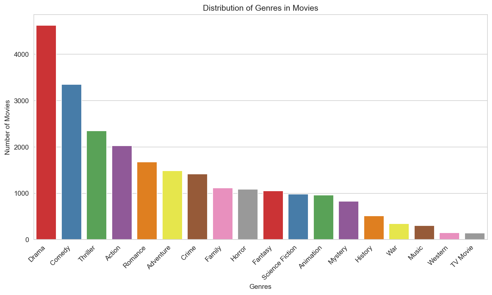
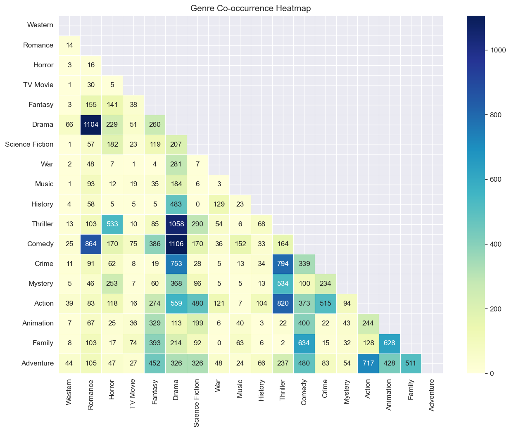
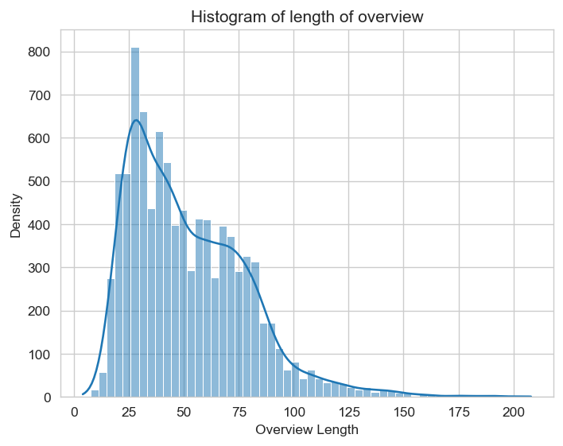

# Multilabel Movie Genre Classification

## Overview

In this Project, we use plot overview of movies to predict the different genres they belong to using both machine learning as well as deep learning approaches. The problem is approached as one of multilabel classification as movies belong to more than one genre.

## Table of Contents
+ [Overview](#overview)
+ [Table of Contents](#table-of-contents)
+ [Dataset](#dataset)
+ [Model Architecture](#model-architecture)
+ [Preprocessing](#preprocessing)
+ [Training](#training)
+ [Evaluation](#evaluation)
+ [Usage](#usage)
+ [Dependencies](#dependencies)

## Dataset

The dataset for this project has been taken from kaggle and can be found [here](https://www.kaggle.com/datasets/khushipitroda/movie-genre-detection). It has 9400 entries with 18 different genres that a movie can belong to. 

The distribution of genre labels is as follows:

There are some genres which overlap with each other more than some other as can be seen from this heatmap:

The word length of the plot overview provided in the dataset varies as given below with overview length for 95% of movies being under 100 and 99% under 140:

## Model Architecture

## Preprocessing

## Training

## Evaluation

## Usage

## Dependencies